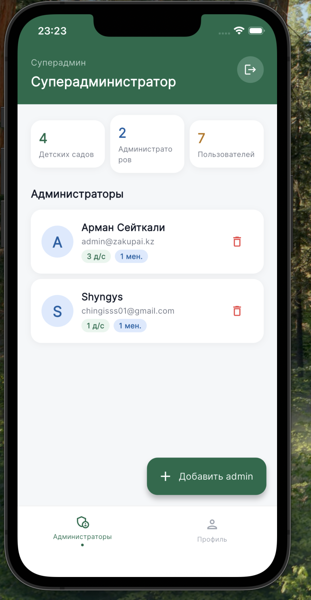
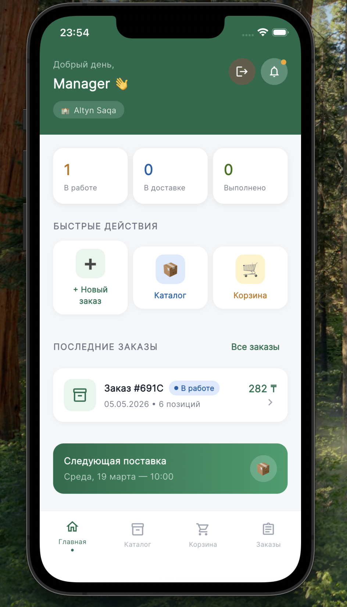
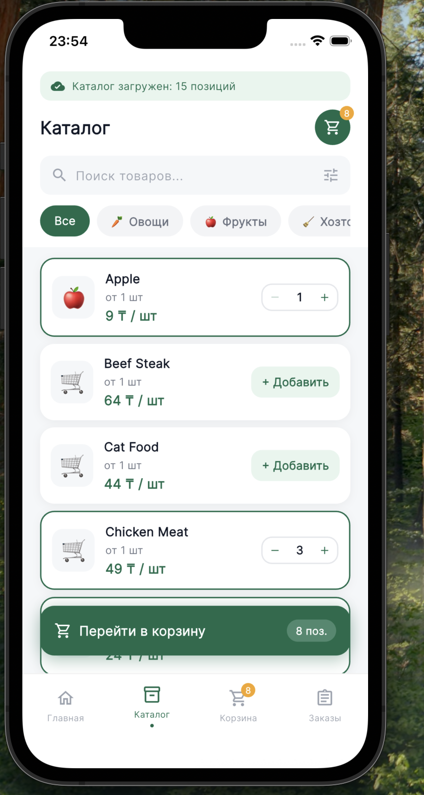
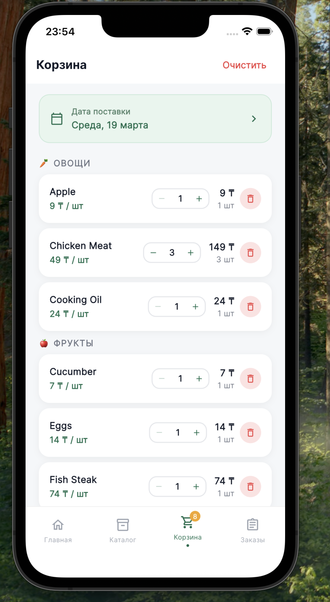
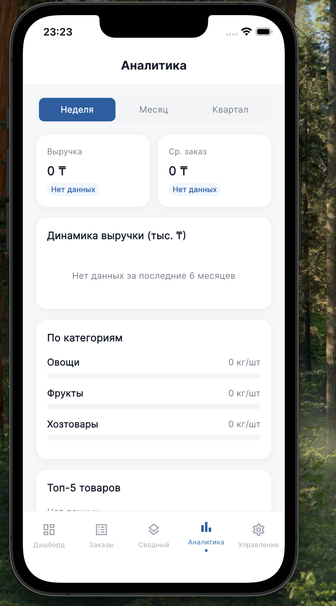
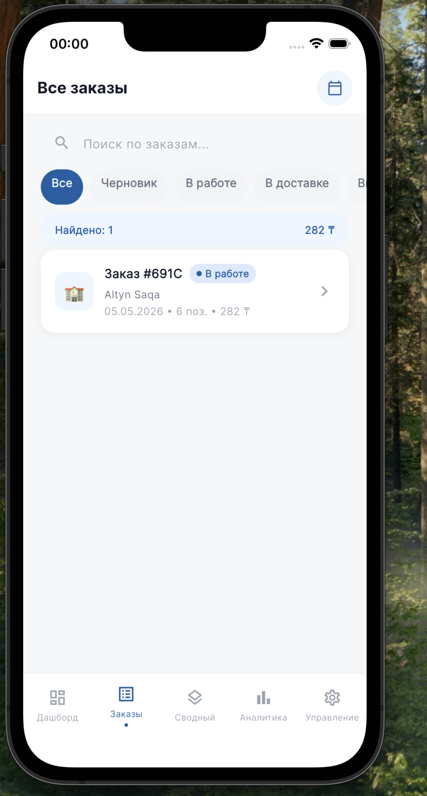
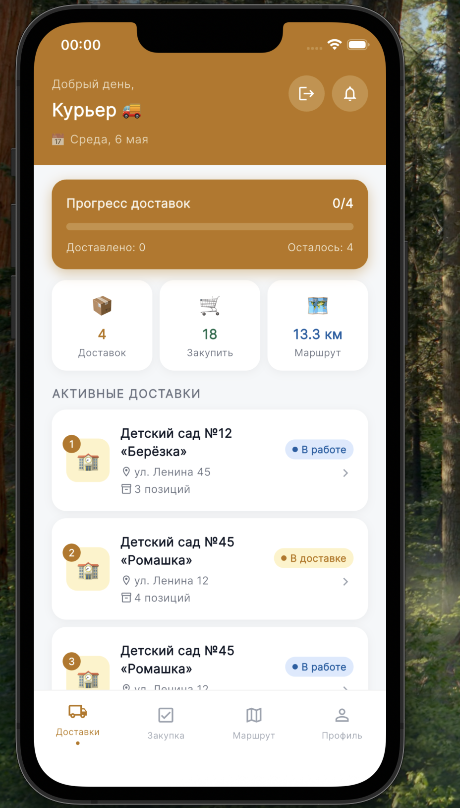
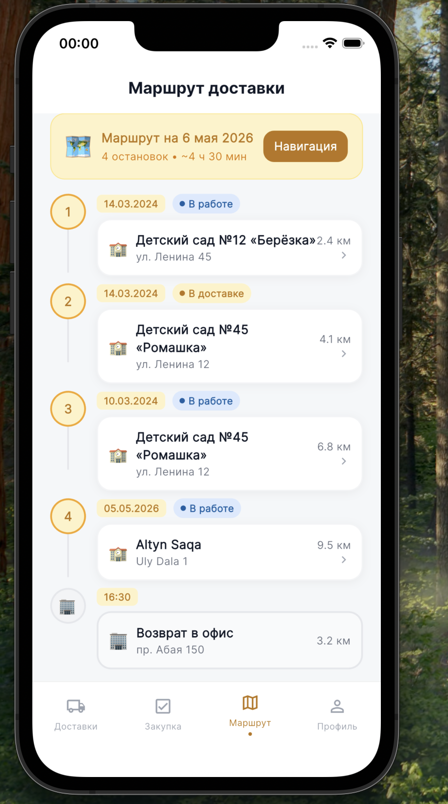

# zakupAI — Система закупок для детских садов

> Финальный проект курса **Flutter с нуля** · DataGroup Academy · 6 месяцев

Мобильное B2B-приложение для автоматизации закупок продуктов питания в детских садах. Менеджеры формируют заказы, администраторы управляют сетью учреждений, курьеры выполняют доставки.

---

## Скриншоты

<table>
  <tr>
    <td align="center"><br/><sub>Вход в систему</sub></td>
    <td align="center"><br/><sub>Главная менеджера</sub></td>
    <td align="center"><br/><sub>Каталог товаров</sub></td>
    <td align="center"><br/><sub>Корзина</sub></td>
  </tr>
  <tr>
    <td align="center"><br/><sub>Дашборд администратора</sub></td>
    <td align="center"><br/><sub>Все заказы</sub></td>
    <td align="center"><br/><sub>Главная курьера</sub></td>
    <td align="center"><br/><sub>Маршрут доставки</sub></td>
  </tr>
</table>

---

## Функциональные возможности (MVP)

### ✅ Авторизация
- Вход по email + пароль, сохранение сессии между запусками (`SharedPreferences`)
- Регистрация нового менеджера
- Ролевая маршрутизация: **Суперадмин → Администратор → Менеджер → Курьер**

### ✅ CRUD сущностей
| Сущность | Создание | Просмотр | Обновление | Удаление |
|---|:---:|:---:|:---:|:---:|
| Заказ | ✅ | ✅ | ✅ (статус) | ✅ |
| Детский сад | ✅ | ✅ | — | — |
| Пользователь (менеджер/курьер) | ✅ | ✅ | — | ✅ |
| Корзина | ✅ | ✅ | ✅ | ✅ |

### ✅ Фильтрация и поиск
- Каталог: поиск по названию + фильтр по категории (овощи / фрукты / хозтовары)
- Заказы администратора: поиск по номеру/учреждению + фильтр по статусу
- Аналитика: переключение периода (неделя / месяц / квартал)

### ✅ Графики и аналитика (`fl_chart`)
- Столбчатая диаграмма заказов по дням недели (дашборд администратора)
- Линейный график динамики выручки (аналитика)
- Горизонтальные бары по категориям
- Прогресс-бары топ-5 продуктов
- Активность учреждений

### ✅ Офлайн-режим
- Все данные хранятся локально в **Hive** (users, kindergartens, orders, cart)
- Приложение полностью работает без интернета
- При недоступности API продукты подгружаются из локального кэша (offline-first)

---

## Технологический стек

| Слой | Технология |
|---|---|
| UI | Flutter 3.27 + Material 3 |
| Управление состоянием | **Riverpod** `StateNotifier` |
| Навигация | **go_router** + `ShellRoute` |
| Локальная БД | **Hive** |
| HTTP-клиент | **http** |
| Графики | **fl_chart** |
| Шрифты | Google Fonts (Inter) |
| Сессия | SharedPreferences |

---

## Архитектура

```
lib/
├── core/
│   ├── theme/          # AppColors, AppTheme, OrderStatusExt
│   ├── utils/          # format_utils.dart (форматирование валюты/чисел)
│   ├── widgets/        # StatusChip, TopBar, SectionLabel, QuantityStepper
│   ├── constants/
│   └── router/         # AppRouter, go_router конфигурация
│
├── data/
│   ├── datasources/    # RemoteProductDataSource (HTTP → DummyJSON API)
│   ├── models/         # re-exports из domain/entities
│   ├── repositories/   # ProductRepositoryImpl, product_repository_provider
│   └── seed_data.dart  # re-export из domain/seed_data
│
├── domain/
│   ├── entities/       # Product, AppUser, Kindergarten, OrderEntity, CartItem…
│   ├── repositories/   # abstract: AuthRepository, OrderRepository, CartRepository, ProductRepository
│   ├── usecases/       # LoginUseCase, LogoutUseCase, GetOrdersUseCase…
│   └── seed_data.dart  # Начальные данные (чистые domain-сущности)
│
├── presentation/
│   ├── providers/      # AuthNotifier, OrderNotifier, CartNotifier, ProductNotifier
│   ├── screens/        # admin/, manager/, courier/, superadmin/, auth/
│   └── widgets/        # re-exports из core/widgets
│
└── main.dart
```

### Ключевые архитектурные правила

| Правило | Статус |
|---|---|
| `presentation` не импортирует из `data` | ✅ |
| `domain` без `flutter/material.dart` | ✅ |
| Репозитории через `abstract class` | ✅ (4 интерфейса) |
| `setState` только для локального UI | ✅ |

---

## Роли пользователей

| Роль | Возможности |
|---|---|
| **Суперадмин** | Создание/удаление администраторов, просмотр всей системы |
| **Администратор** | Управление детсадами, менеджерами и курьерами; дашборд; аналитика; сводный заказ |
| **Менеджер** | Каталог товаров, корзина, оформление заказов, история заказов |
| **Курьер** | Активные доставки, закупочный лист, маршрут, профиль |

### Тестовые аккаунты

| Роль | Email | Пароль |
|---|---|---|
| Суперадмин | `superadmin@zakupai.kz` | `super123` |
| Администратор | `admin@zakupai.kz` | `admin123` |
| Менеджер | `manager@zakupai.kz` | `manager123` |
| Курьер | `courier@zakupai.kz` | `courier123` |

---

## Расширенный функционал

- ✅ **Unit-тесты** — 9 тестов для use cases (`test/usecases_test.dart`)
- ✅ **HTTP API** — загрузка каталога с DummyJSON (`https://dummyjson.com/products/category/groceries`)

---

## Запуск проекта

### Требования
- Flutter 3.27+ (Channel stable)
- Dart 3.6+

### Установка и запуск

```bash
# 1. Клонировать репозиторий
git clone https://github.com/<your-username>/zakup_ai_project.git
cd zakup_ai_project

# 2. Установить зависимости
flutter pub get

# 3. Запустить
flutter run
```

### Сборка release APK

```bash
flutter build apk --release --no-tree-shake-icons
```

Готовый APK: `build/app/outputs/flutter-apk/app-release.apk`

---

## Unit-тесты

```bash
flutter test test/usecases_test.dart
```

Покрываются: `LoginUseCase`, `LogoutUseCase`, `GetOrdersUseCase`, `CreateOrderUseCase`, `UpdateOrderStatusUseCase` — итого **9 тестов**.

---

## Структура коммитов

```
chore: init project, add dependencies, setup theme and colors
arch(router): configure go_router with ShellRoutes
feat(role-select): implement role selection screen
feat(manager-shell): add BottomNav with cart badge
feat(catalog): add product catalog with search and filter
feat(cart): implement shopping cart with grouping and checkout
feat(admin-dashboard): implement dashboard with fl_chart
feat(analytics): add analytics with line and bar charts
feat(courier-home): implement courier home with deliveries
feat(riverpod): migrate all state management to StateNotifier
feat(api): integrate DummyJSON product catalog API
feat(arch): move shared widgets to core/, add format_utils
test(domain): add 9 unit tests for use cases
```

---

*DataGroup Academy · Flutter с нуля · 2024–2025*
